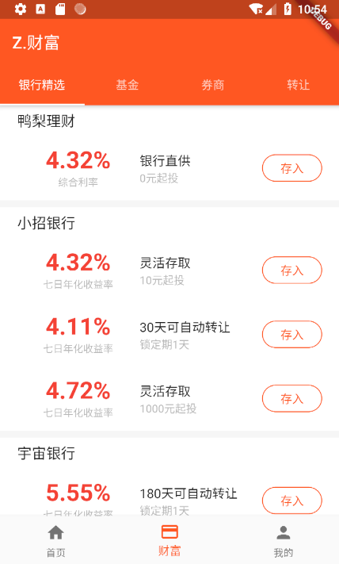
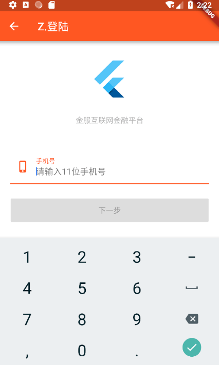

# flutter_app

> 这是一个使用flutter编写的金融理财项目

项目计划
* [x] 静态页面
* [x] 有状态widget
* [x] 屏幕适配（ScreenUtil）
* [x] 事件处理
* [x] 页面路由
* [x] 无限轮播
* [x] EvnetBus
* [x] 封装httpClient
* [x] koa2 node服务器
* [ ] node架构完善
* [ ] 统一路由动画
* [ ] Redux
* [ ] RxDart

效果图：

外链:
- [flutter官网](https://flutter.io/docs/get-started/codelab)
- [API文档](https://flutter.io/docs/cookbook)
