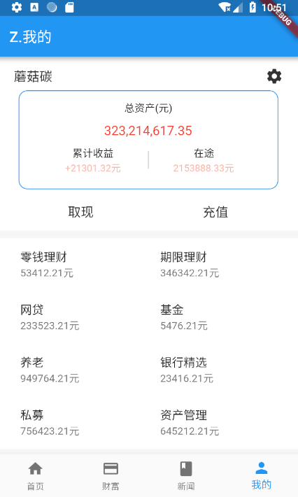

# flutter_app

> 这是一个功能齐全的 flutter 金融理财APP项目

### 效果图：

 |     |  |  |
| ---------------------------------------- | --------------------------------- | --------------------------------------- |
|  |  |  | 

### 动态图（压缩的失真了。见谅）

|    |  |
| ---------------------------------------- | ---------------------------------------- |

### 项目计划
* [x] 静态页面
* [x] ScreenUtil 屏幕适配
* [x] 路由 & 路由回调
* [x] 封装无限轮播图
* [x] EvnetBus
* [x] 封装httpClient请求
* [x] koa2 node服务器
* [x] 请求数据动态拼接
* [x] 实现 webview
* [x] Storage 保持登录状态
* [ ] 统一路由动画
* [ ] PageStorage 页面重绘
* [ ] Redux
* [ ] node架构完善
* [ ] RxDart

### 外链:
- [flutter官网](https://flutter.io/docs/get-started/codelab)
- [API文档](https://flutter.io/docs/cookbook)
