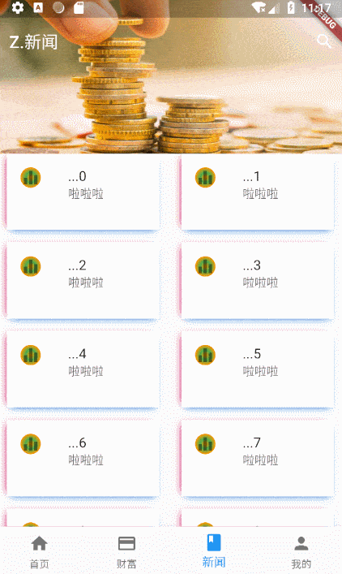

# 蘑菇碳的Flutter金融理财App

```
    RN是一种中间妥协方案，它会被浏览器技术的进步而取代，而Flutter是更加面向未来的一种彻底的跨平台渲染框架。

        by 闲鱼架构师：邬吉风
```

没错。用了Flutter就停不下来了。

> Example尽量多些常用的交互，少写些静态页面。

## 喜欢请Star，尽量别 Fork。

***

### 项目介绍

* 项目主要部分都有注释
* 采用`IndexedStack`作为大框架，设置：按需加载和缓存。
* 请求封装在`/lib/api/my_xhr.dart`
* 后台服务放置于`/back-end`目录，使用NodeJS搭建（单纯读JSON返回）
* 屏幕适配使用了李卓原的适配方案，源码放置于`/lib/unit/screen_util_source.dart`
* 登陆使用`SharedPreferences`(类似`LocalStorage`)实现长期登陆。
* 轮播图使用`SingleTickerProviderStateMixin`的`Control`+`PageView`+`TabPageSelector`+`Timer`实现
* 动态路由封装在`/lib/unit/route_animation.dart`
* EventBus使用FlutterChina的方式
* 财富页仿蚂蚁财富定期理财，利用`TabBar`+`TabBarView`实现，同时使用`AutomaticKeepAliveClientMixin`重写`wantKeepAlive`
* 银行精选使用for循环各种拼装的方式实现渲染
* WebView使用`flutter_webview_plugin`实现
* 登录页仿陆金所登陆，主要使用`Wrap`实现
* 新闻页仿微信朋友圈，使用`CustomScrollView`+`SliverGrid`实现

### 效果图

 |     |  |  |
| ---------------------------------------- | --------------------------------- | --------------------------------------- |
|  |  |  | 

### 动态图（录制+压缩过程导致图片失真，请见谅）

|    |  |  |
| ---------------------------------------- | ---------------------------------------- | --------------------------- |


### 项目计划
* [x] 静态页面
* [x] ScreenUtil 屏幕适配
* [x] 路由 + 回调 + 动画
* [x] 封装无限轮播图
* [x] EvnetBus
* [x] 封装httpClient请求
* [x] koa2 + node 后台服务器
* [x] 请求数据动态拼接
* [x] Storage 保持登录状态
* [x] 实现 webview
* [x] 缓存组件
* [x] 页面 keepa-live
* [x] 解决页面切换重绘问题
* [ ] Redux
* [ ] node架构完善
* [ ] RxDart

### 外链:
- [API文档](https://flutter.io/docs/get-started/codelab)
